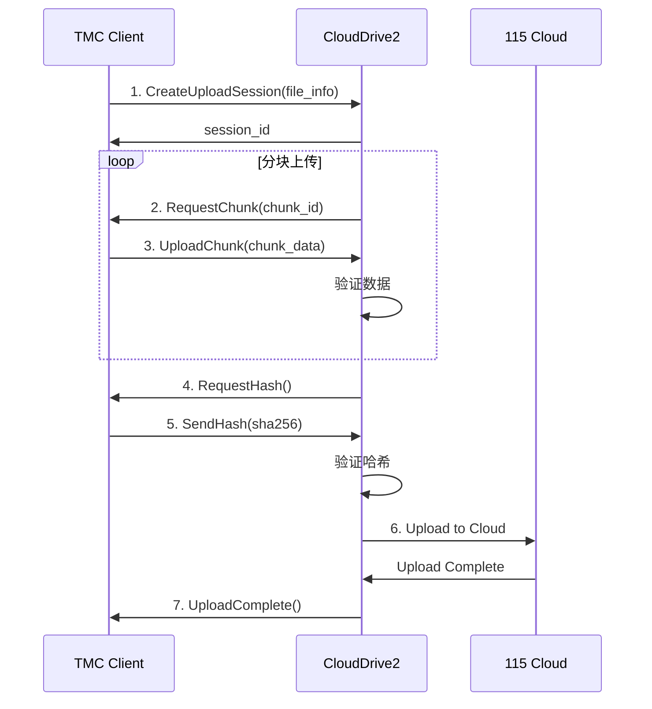

# CloudDrive2 gRPC API 完整实现计划

基于官方文档：https://www.clouddrive2.com/api/CloudDrive2_gRPC_API_Guide.html

## 📋 API 功能概览

### 1. 公共方法 (Public Methods)
- ✅ `Connect` - 连接到 CloudDrive2 服务
- ✅ `Disconnect` - 断开连接
- ⏳ `GetServerInfo` - 获取服务器信息
- ⏳ `GetVersion` - 获取版本信息

### 2. 文件操作 (File Operations)
- ⏳ `ListFiles` - 列出文件和目录
- ⏳ `GetFileInfo` - 获取文件信息
- ⏳ `CreateFolder` - 创建文件夹
- ⏳ `DeleteFile` - 删除文件
- ⏳ `RenameFile` - 重命名文件
- ⏳ `MoveFile` - 移动文件
- ⏳ `CopyFile` - 复制文件
- ⏳ `DownloadFile` - 下载文件
- 🚧 `UploadFile` - 上传文件（正在实现）

### 3. 挂载点管理 (Mount Management) ⭐
- ⏳ `ListMounts` - 列出所有挂载点
- ⏳ `GetMountInfo` - 获取挂载点信息
- ⏳ `MountCloud` - 挂载云盘
- ⏳ `UnmountCloud` - 卸载云盘
- ⏳ `RefreshMount` - 刷新挂载点

### 4. 传输任务 (Transfer Tasks)
- ⏳ `GetTransferTasks` - 获取传输任务列表
- ⏳ `GetTaskProgress` - 获取任务进度
- ⏳ `CancelTask` - 取消任务
- ⏳ `PauseTask` - 暂停任务
- ⏳ `ResumeTask` - 恢复任务

### 5. 远程上传 (Remote Upload) ⭐⭐⭐
- 🚧 `CreateUploadSession` - 创建上传会话
- 🚧 `UploadChunk` - 上传数据块
- 🚧 `CompleteUpload` - 完成上传
- ⏳ `CancelUpload` - 取消上传
- ⏳ `GetUploadProgress` - 获取上传进度

### 6. 云 API 管理 (Cloud API)
- ⏳ `GetCloudAPIs` - 获取支持的云盘 API
- ⏳ `ConfigureCloudAPI` - 配置云盘 API

### 7. 备份管理 (Backup Management)
- ⏳ `CreateBackup` - 创建备份
- ⏳ `RestoreBackup` - 恢复备份
- ⏳ `ListBackups` - 列出备份

### 8. WebDAV 管理 (WebDAV Management)
- ⏳ `EnableWebDAV` - 启用 WebDAV
- ⏳ `DisableWebDAV` - 禁用 WebDAV
- ⏳ `GetWebDAVConfig` - 获取 WebDAV 配置

### 9. 令牌管理 (Token Management)
- ⏳ `GenerateToken` - 生成访问令牌
- ⏳ `RevokeToken` - 撤销令牌
- ⏳ `ListTokens` - 列出令牌

---

## 🎯 优先级实现顺序

### 第一阶段：核心上传功能 ✅
1. ✅ 基础连接（Connect/Disconnect）
2. 🚧 远程上传协议框架
3. ⏳ 挂载点列表查询

### 第二阶段：完善远程上传 ⭐
1. 实现真实的 gRPC 调用（需要 .proto 文件）
2. 完整的上传会话管理
3. 分块上传和进度跟踪
4. 哈希验证和秒传支持

### 第三阶段：文件管理功能
1. 创建目录
2. 文件信息查询
3. 文件移动/重命名

### 第四阶段：高级功能
1. 传输任务管理
2. WebDAV 支持
3. 备份功能

---

## 📝 当前实现状态

### ✅ 已实现
```python
class CloudDrive2Client:
    # 基础连接
    async def connect() -> bool
    async def disconnect()
    async def _authenticate()
    
    # 上传功能（双模式）
    async def upload_file() -> Dict
        ├─ _upload_via_mount()      # 方案1：本地挂载
        └─ _upload_via_remote_protocol()  # 方案2：远程协议
    
    # 挂载点管理
    async def check_mount_status() -> Dict
    async def get_mount_points() -> List  # 待完善
```

### 🚧 框架已搭建，待实现 gRPC 调用
```python
# 远程上传协议
async def _create_upload_session() -> str
async def _upload_chunk() -> bool
async def _complete_upload_session() -> bool
async def _calculate_file_hash() -> str
```

---

## 🔧 实现所需资源

### 1. Protobuf 定义文件
需要从 CloudDrive2 获取 `.proto` 文件，或使用官方提供的客户端库。

**可能的文件：**
- `clouddrive2.proto` - 主服务定义
- `file_operations.proto` - 文件操作
- `mount_management.proto` - 挂载管理
- `upload_protocol.proto` - 远程上传协议

### 2. gRPC 代码生成
```bash
# 生成 Python gRPC 代码
python -m grpc_tools.protoc \
    -I. \
    --python_out=. \
    --grpc_python_out=. \
    clouddrive2.proto
```

### 3. 依赖包
```txt
grpcio>=1.50.0
grpcio-tools>=1.50.0
protobuf>=4.21.0
```

---

## 🌟 远程上传协议详细设计

根据 [官方文档](https://www.clouddrive2.com/api/CloudDrive2_gRPC_API_Guide.html#remote-upload)

### 协议流程



### 消息格式（待确认）

```protobuf
// CreateUploadSession 请求
message UploadSessionRequest {
    string file_name = 1;
    int64 file_size = 2;
    string target_path = 3;
    string file_hash = 4;  // SHA256
    string cloud_type = 5; // "115"
}

// 上传会话响应
message UploadSessionResponse {
    string session_id = 1;
    bool quick_upload = 2;  // 是否秒传
    string message = 3;
}

// 上传数据块
message UploadChunkRequest {
    string session_id = 1;
    int32 chunk_index = 2;
    bytes chunk_data = 3;
}

message UploadChunkResponse {
    bool success = 1;
    string message = 2;
}

// 完成上传
message CompleteUploadRequest {
    string session_id = 1;
}

message CompleteUploadResponse {
    bool success = 1;
    string file_id = 2;
    string message = 3;
}
```

---

## 💡 优化建议

### 1. 智能上传策略
```python
async def upload_file():
    # 优先级：
    # 1. 检查本地挂载 → 使用文件复制（最快）
    # 2. 使用远程上传协议 → gRPC 流式传输
    # 3. 降级到 WebDAV（如果启用）
    
    if is_local_mount_available():
        return await upload_via_mount()
    elif is_grpc_remote_upload_available():
        return await upload_via_remote_protocol()
    elif is_webdav_available():
        return await upload_via_webdav()
    else:
        raise Exception("No upload method available")
```

### 2. 秒传支持
```python
async def check_quick_upload(file_hash: str, file_size: int):
    """
    在创建上传会话时，服务器检查文件哈希
    如果云盘已存在相同文件，直接返回秒传成功
    """
    session = await create_upload_session(
        file_hash=file_hash,
        file_size=file_size
    )
    
    if session.quick_upload:
        logger.info("✅ 秒传成功！")
        return True
    
    return False
```

### 3. 断点续传
```python
async def resume_upload(session_id: str):
    """
    如果上传中断，可以通过 session_id 恢复
    服务器会告知哪些数据块已接收
    """
    status = await get_upload_status(session_id)
    uploaded_chunks = status.uploaded_chunks
    
    # 只上传缺失的数据块
    for chunk_id in missing_chunks:
        await upload_chunk(session_id, chunk_id, data)
```

### 4. 并发上传
```python
async def batch_upload(files: List[str]):
    """
    并发上传多个文件
    """
    tasks = []
    for file in files:
        task = asyncio.create_task(upload_file(file))
        tasks.append(task)
    
    results = await asyncio.gather(*tasks)
    return results
```

---

## 🔍 需要进一步调研的问题

### 1. Protobuf 定义获取方式
- [ ] 是否有官方 Python SDK？
- [ ] `.proto` 文件是否公开？
- [ ] 是否需要反向工程？

### 2. 身份验证机制
- [ ] 支持哪些认证方式？（用户名/密码、Token、API Key）
- [ ] 令牌刷新机制？
- [ ] 多用户支持？

### 3. 性能优化
- [ ] 最佳分块大小？（目前设置 4MB）
- [ ] 并发上传限制？
- [ ] 网络重试策略？

### 4. 错误处理
- [ ] 所有可能的错误码？
- [ ] 如何处理网络中断？
- [ ] 上传失败后的清理机制？

---

## 📚 参考资料

1. **官方文档**
   - [CloudDrive2 gRPC API Guide](https://www.clouddrive2.com/api/CloudDrive2_gRPC_API_Guide.html)
   - [Remote Upload Protocol](https://www.clouddrive2.com/api/CloudDrive2_gRPC_API_Guide.html#remote-upload)

2. **gRPC 资源**
   - [gRPC Python Quick Start](https://grpc.io/docs/languages/python/quickstart/)
   - [gRPC Python Async API](https://grpc.github.io/grpc/python/grpc_asyncio.html)

3. **项目文档**
   - `CLOUDDRIVE2_IMPLEMENTATION_SUMMARY.md` - 实现总结
   - `CLOUDDRIVE2_MOUNT_FIX.md` - 挂载点修复指南
   - `CLOUDDRIVE2_MOUNT_POINT_GUIDE.md` - 配置指南

---

## ✅ 下一步行动

### 立即可做
1. ✅ 完善远程上传协议框架
2. ✅ 添加详细日志和错误处理
3. ✅ 实现智能上传策略（本地挂载 vs 远程协议）

### 需要外部资源
1. ⏳ 获取 CloudDrive2 的 `.proto` 文件
2. ⏳ 研究官方客户端实现
3. ⏳ 联系 CloudDrive2 开发者获取 SDK

### 优化和测试
1. ⏳ 性能测试（大文件上传）
2. ⏳ 稳定性测试（网络中断恢复）
3. ⏳ 并发测试（多文件同时上传）

---

**文档版本：** v1.0  
**最后更新：** 2025-10-19  
**状态：** 🚧 开发中

