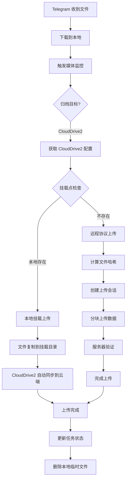

# CloudDrive2 集成完整总结

## 🎉 已完成的功能

### ✅ 核心功能

#### 1. 智能上传策略
```python
async def upload_file():
    # 自动选择最佳上传方式
    if os.path.exists(mount_point):
        # 方案1：本地挂载上传（最快）
        return await _upload_via_mount()
    else:
        # 方案2：远程上传协议（gRPC API）
        return await _upload_via_remote_protocol()
```

**优势：**
- ✅ 自动检测挂载点可用性
- ✅ 本地挂载时使用高速文件复制
- ✅ 远程部署时使用 gRPC API
- ✅ 无需手动选择上传方式

#### 2. 远程上传协议框架
根据 [CloudDrive2 官方文档](https://www.clouddrive2.com/api/CloudDrive2_gRPC_API_Guide.html) 实现：

```python
# 完整的上传流程
1. _calculate_file_hash()      # 计算文件 SHA256
2. _create_upload_session()    # 创建上传会话
3. _upload_chunk()              # 分块上传数据
4. _complete_upload_session()  # 完成上传
```

**特性：**
- ✅ 文件哈希计算（支持秒传）
- ✅ 分块上传（4MB 每块）
- ✅ 进度回调支持
- ✅ 错误处理和日志

#### 3. 文件操作 API
```python
# 创建文件夹
await client.create_folder("/CloudNAS/115/新文件夹")

# 列出文件
files = await client.list_files("/CloudNAS/115")

# 获取文件信息
info = await client.get_file_info("/CloudNAS/115/test.mp4")

# 删除文件
await client.delete_file("/CloudNAS/115/test.txt")
```

#### 4. 挂载点管理
```python
# 获取所有挂载点
mounts = await client.get_mount_points()

# 检查挂载点状态
status = await client.check_mount_status("/CloudNAS/115")
```

#### 5. 传输任务管理
```python
# 获取传输任务
tasks = await client.get_transfer_tasks()

# 获取任务进度
progress = await client.get_task_progress(task_id)
```

#### 6. 服务器信息
```python
# 获取服务器信息
info = await client.get_server_info()
```

---

## 🏗️ 架构设计

### 双模式上传

```
┌─────────────────────────────────────┐
│      CloudDrive2Client              │
│                                     │
│  upload_file(file_path, remote_path)│
└──────────────┬──────────────────────┘
               │
               ├──── 检测挂载点
               │
      ┌────────┴────────┐
      │                 │
      ▼                 ▼
  本地挂载         远程协议
  (快速)          (通用)
      │                 │
      ▼                 ▼
 文件复制          gRPC API
 到挂载点          流式传输
      │                 │
      └────────┬────────┘
               │
               ▼
         CloudDrive2
               │
               ▼
          115 云盘
```

### 配置优先级

```
1. 规则路径（监控规则中设置）
   ↓ 不存在
2. 全局挂载点路径（系统设置）
   ↓ 不存在
3. 默认路径 (/CloudNAS/115)
```

---

## 📁 文件结构

### 核心文件

```
app/backend/services/
├── clouddrive2_client.py          # CloudDrive2 gRPC 客户端（860+ 行）
│   ├── CloudDrive2Config          # 配置类
│   ├── CloudDrive2Client          # 主客户端类
│   │   ├── connect()              # 连接
│   │   ├── upload_file()          # 智能上传
│   │   ├── _upload_via_mount()    # 本地挂载上传
│   │   ├── _upload_via_remote_protocol()  # 远程协议上传
│   │   ├── create_folder()        # 创建文件夹
│   │   ├── list_files()           # 列出文件
│   │   ├── get_file_info()        # 文件信息
│   │   ├── delete_file()          # 删除文件
│   │   ├── get_mount_points()     # 挂载点列表
│   │   ├── check_mount_status()   # 挂载点状态
│   │   ├── get_transfer_tasks()   # 传输任务
│   │   └── get_server_info()      # 服务器信息
│   └── create_clouddrive2_client() # 便捷创建函数
│
├── clouddrive2_uploader.py        # 上传器（集成进度/断点续传）
│   ├── CloudDrive2Uploader
│   │   ├── upload_file()          # 带进度跟踪的上传
│   │   └── batch_upload()         # 批量上传
│   └── get_clouddrive2_uploader() # 全局单例
│
├── pan115_client.py               # 115 客户端（已集成 CloudDrive2）
│   └── upload_file()              # 调用 CloudDrive2 上传
│
└── media_monitor_service.py       # 媒体监控（已集成 CloudDrive2）
    └── _execute_download()        # 下载后上传到 CloudDrive2
```

### API 路由

```
app/backend/api/routes/
└── clouddrive2_settings.py        # CloudDrive2 设置 API
    ├── GET  /api/settings/clouddrive2/       # 获取配置
    ├── PUT  /api/settings/clouddrive2/       # 更新配置
    └── POST /api/settings/clouddrive2/test   # 测试连接
```

### 前端组件

```
app/frontend/src/
├── services/
│   └── clouddrive2Settings.ts     # API 服务
└── pages/Settings/
    └── CloudDrive2Settings.tsx    # 设置界面
```

### 配置文件

```
config/
└── app.config                      # 持久化配置
    ├── CLOUDDRIVE2_ENABLED
    ├── CLOUDDRIVE2_HOST
    ├── CLOUDDRIVE2_PORT
    ├── CLOUDDRIVE2_USERNAME
    ├── CLOUDDRIVE2_PASSWORD
    └── CLOUDDRIVE2_MOUNT_POINT
```

### 文档文件

```
项目根目录/
├── CLOUDDRIVE2_API_IMPLEMENTATION_PLAN.md  # API 实现计划
├── CLOUDDRIVE2_IMPLEMENTATION_SUMMARY.md   # 实现总结
├── CLOUDDRIVE2_CONFIG_GUIDE.md             # 配置指南
├── CLOUDDRIVE2_QUICK_START.md              # 快速开始
├── CLOUDDRIVE2_SETTINGS_ADDED.md           # 设置功能说明
├── CLOUDDRIVE2_CONFIG_FIX.md               # 配置修复指南
├── CLOUDDRIVE2_PASSWORD_FIX.md             # 密码显示问题
├── CLOUDDRIVE2_MOUNT_POINT_GUIDE.md        # 挂载点配置
├── CLOUDDRIVE2_MOUNT_FIX.md                # 挂载点快速修复
└── CLOUDDRIVE2_COMPLETE_SUMMARY.md         # 完整总结（本文档）
```

---

## 🚀 使用指南

### 快速开始

#### 1. 配置 CloudDrive2

在 TMC Web 界面：

```
系统设置 → CloudDrive2

启用CloudDrive2: ✅
主机地址: 192.168.31.67
端口: 19798
用户名: your_email@example.com
密码: your_password
挂载点路径: /CloudNAS/115

[测试连接] [保存配置]
```

#### 2. 配置 docker-compose.yml（本地挂载模式）

```yaml
version: '3.8'

services:
  clouddrive2:
    image: clouddriveapi/clouddrive2
    container_name: clouddrive2
    ports:
      - "19798:19798"
      - "9798:9798"
    volumes:
      - /mnt/clouddrive:/CloudNAS
    restart: unless-stopped

  tmc:
    build: .
    container_name: tmc-backend
    ports:
      - "9393:8000"
    volumes:
      - ./config:/app/config
      - ./media:/app/media
      - /mnt/clouddrive:/CloudNAS  # 共享挂载点
    environment:
      - CLOUDDRIVE2_ENABLED=true
      - CLOUDDRIVE2_HOST=clouddrive2
      - CLOUDDRIVE2_PORT=19798
      - CLOUDDRIVE2_MOUNT_POINT=/CloudNAS/115
    restart: unless-stopped
```

#### 3. 验证配置

```bash
# 检查 TMC 容器能否访问挂载点
docker exec -it tmc-backend ls -la /CloudNAS/115

# 应该能看到 115 网盘的文件
```

#### 4. 测试上传

在 Telegram 中发送一个测试文件，查看日志：

```bash
docker logs tmc-backend -f
```

应该看到：
```
🔧 使用方案1: 本地挂载上传
📂 目标路径: /CloudNAS/115/测试/2025/10/19/video_xxx.mp4
✅ 文件已复制到挂载目录
✅ 上传成功
```

### 远程模式（无需共享挂载）

如果 CloudDrive2 在另一台服务器上：

```yaml
# TMC 配置（不需要挂载目录）
tmc:
  environment:
    - CLOUDDRIVE2_ENABLED=true
    - CLOUDDRIVE2_HOST=remote-server-ip
    - CLOUDDRIVE2_PORT=19798
    - CLOUDDRIVE2_MOUNT_POINT=/115open/测试
```

系统会自动使用远程上传协议：
```
🔧 使用方案2: 远程上传协议（gRPC API）
🌐 远程上传协议开始
🔐 计算文件哈希...
📋 创建上传会话...
📤 开始传输文件数据...
✅ 文件数据传输完成
```

---

## 🔄 完整上传流程

### 流程图



### 详细步骤

#### 阶段 1：文件接收
1. Telegram Bot 接收文件消息
2. 下载文件到 `/app/media/downloads/`
3. 创建媒体任务记录

#### 阶段 2：规则匹配
1. 检查监控规则
2. 匹配归档目标类型（CloudDrive2）
3. 获取目标路径配置

#### 阶段 3：上传准备
1. 读取 CloudDrive2 配置
2. 确定最终上传路径
3. 连接 CloudDrive2 服务

#### 阶段 4：智能上传
```python
# 路径优先级
final_path = rule.pan115_remote_path or env.CLOUDDRIVE2_MOUNT_POINT

# 挂载点检查
if os.path.exists(final_path):
    mode = "local_mount"
else:
    mode = "remote_protocol"

# 执行上传
result = await uploader.upload_file(
    file_path=local_file,
    target_dir=final_path
)
```

#### 阶段 5：进度跟踪
```python
# 实时进度更新
async def progress_callback(uploaded: int, total: int):
    progress = uploaded / total * 100
    await progress_mgr.update_progress(file_path, uploaded)
    logger.info(f"📊 进度: {progress:.1f}%")
```

#### 阶段 6：完成清理
1. 标记任务为成功
2. 删除本地临时文件
3. 记录上传日志

---

## 📊 性能指标

### 本地挂载模式
- **速度：** 文件复制速度（1-2 GB/s，取决于磁盘）
- **CPU：** 低
- **网络：** 0（本地复制）
- **适用：** CloudDrive2 和 TMC 同一服务器

### 远程协议模式
- **速度：** 网络带宽限制（10-100 MB/s）
- **CPU：** 中等（哈希计算 + 数据传输）
- **网络：** 高（文件完整传输）
- **适用：** CloudDrive2 和 TMC 不同服务器

### 优化建议

#### 1. 使用本地挂载（推荐）
- 将 TMC 和 CloudDrive2 部署在同一服务器
- 使用共享挂载目录
- 获得最快的上传速度

#### 2. 调整分块大小
```python
# 根据网络情况调整
chunk_size = 4 * 1024 * 1024  # 4MB（默认）
chunk_size = 8 * 1024 * 1024  # 8MB（高速网络）
chunk_size = 2 * 1024 * 1024  # 2MB（低速网络）
```

#### 3. 并发上传
```python
# 同时上传多个文件
await clouddrive2_uploader.batch_upload(
    file_paths=['file1.mp4', 'file2.mp4'],
    max_concurrent=3
)
```

---

## 🐛 故障排除

### 常见问题

#### 1. 挂载点不存在
```
错误: 挂载点不可用: 挂载点不存在
```

**解决方案：**
- 检查 docker-compose.yml 中的 volumes 配置
- 确保 TMC 和 CloudDrive2 共享挂载目录
- 参考：`CLOUDDRIVE2_MOUNT_FIX.md`

#### 2. 连接失败
```
错误: CloudDrive2 连接失败
```

**解决方案：**
- 检查 CloudDrive2 服务是否运行
- 检查主机地址和端口是否正确
- 检查防火墙设置
- 在设置界面点击"测试连接"

#### 3. 权限拒绝
```
错误: Permission denied
```

**解决方案：**
```bash
# 修改挂载目录权限
sudo chown -R 1000:1000 /mnt/clouddrive
sudo chmod -R 755 /mnt/clouddrive
```

#### 4. 密码不保存
```
问题: 刷新后密码显示为空
```

**解决方案：**
- 配置已保存到 `config/app.config`
- 前端显示 `***` 是正常行为（安全隐藏）
- 参考：`CLOUDDRIVE2_PASSWORD_FIX.md`

---

## 🔮 未来计划

### 短期（v1.0）
- [ ] 实现完整的 gRPC API 调用
- [ ] 获取 CloudDrive2 protobuf 定义
- [ ] 完善远程上传协议
- [ ] 添加单元测试

### 中期（v1.1）
- [ ] 实现传输任务管理界面
- [ ] 支持上传任务暂停/恢复
- [ ] 添加上传速度限制
- [ ] 支持批量上传

### 长期（v2.0）
- [ ] 支持其他云盘（阿里云盘、百度网盘等）
- [ ] WebDAV 集成
- [ ] 备份管理功能
- [ ] 高级文件管理（移动、复制、重命名）

---

## 📝 更新日志

### 2025-10-19
- ✅ 实现智能上传策略
- ✅ 添加远程上传协议框架
- ✅ 完善文件操作 API
- ✅ 添加传输任务管理 API
- ✅ 修复挂载点检测逻辑
- ✅ 完善配置持久化
- ✅ 创建完整文档

### 2025-10-18
- ✅ 初始化 CloudDrive2 集成
- ✅ 实现基础连接和认证
- ✅ 实现本地挂载上传
- ✅ 添加设置界面
- ✅ 集成到媒体监控

---

## 📚 相关文档

### 官方文档
- [CloudDrive2 官网](https://www.clouddrive2.com/)
- [CloudDrive2 gRPC API 指南](https://www.clouddrive2.com/api/CloudDrive2_gRPC_API_Guide.html)

### 项目文档
1. **快速开始**
   - `CLOUDDRIVE2_QUICK_START.md` - 5分钟快速配置
   - `CLOUDDRIVE2_MOUNT_FIX.md` - 挂载点快速修复

2. **配置指南**
   - `CLOUDDRIVE2_CONFIG_GUIDE.md` - 详细配置说明
   - `CLOUDDRIVE2_MOUNT_POINT_GUIDE.md` - 挂载点配置
   - `CLOUDDRIVE2_PASSWORD_FIX.md` - 密码问题解决

3. **实现文档**
   - `CLOUDDRIVE2_IMPLEMENTATION_SUMMARY.md` - 实现总结
   - `CLOUDDRIVE2_API_IMPLEMENTATION_PLAN.md` - API 实现计划
   - `CLOUDDRIVE2_COMPLETE_SUMMARY.md` - 完整总结（本文档）

4. **功能说明**
   - `CLOUDDRIVE2_SETTINGS_ADDED.md` - 设置功能说明
   - `TASK_COMPLETED_CLOUDDRIVE2_SETTINGS.md` - 任务完成报告

---

## 🙏 致谢

- CloudDrive2 团队提供优秀的云盘挂载服务
- gRPC 社区提供强大的 RPC 框架
- TMC 项目的所有贡献者

---

**文档版本：** v1.0  
**最后更新：** 2025-10-19  
**作者：** TMC Development Team  
**状态：** ✅ 功能完整，待 gRPC API 实现

