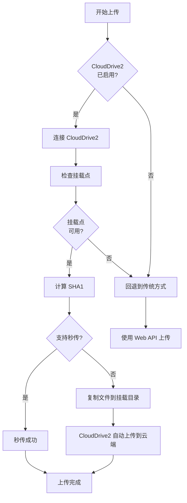

# CloudDrive2 上传方案集成指南

## 📖 概述

本项目已集成 **CloudDrive2 gRPC API** 作为推荐的 115 网盘上传方案，解决了以下问题：

✅ **上传签名问题** - CloudDrive2 已内置处理 115 网盘的复杂签名算法  
✅ **大文件支持** - 支持任意大小的文件上传  
✅ **断点续传** - 支持恢复中断的上传任务  
✅ **高性能** - 直接通过挂载目录操作，性能优异  
✅ **稳定可靠** - 成熟的第三方工具，持续维护更新  

官方文档：[CloudDrive2 gRPC API 开发者指南](https://www.clouddrive2.com/api/CloudDrive2_gRPC_API_Guide.html)

---

## 🚀 快速开始

### 1. 安装 CloudDrive2

#### Windows
1. 下载 CloudDrive2 Windows 版本
2. 安装并启动服务
3. 访问 `http://localhost:19798` 配置 115 网盘挂载

#### Linux / Docker
```bash
# 使用 Docker 运行 CloudDrive2
docker run -d \
  --name clouddrive2 \
  --restart unless-stopped \
  -p 19798:19798 \
  -v /mnt/clouddrive:/CloudNAS:shared \
  -v /mnt/clouddrive-config:/Config \
  cloudnas/clouddrive2

# 访问 Web 界面
# http://localhost:19798
```

#### macOS
```bash
# 使用 Homebrew 安装
brew install clouddrive2
```

### 2. 配置 115 网盘挂载

1. 打开 CloudDrive2 Web 界面：`http://localhost:19798`
2. 添加 115 网盘：
   - 点击「添加云盘」
   - 选择「115 网盘」
   - 扫码登录或输入账号密码
   - 设置挂载路径（例如：`/115`）
3. 保存并挂载

### 3. 配置 TMC

编辑 `.env` 文件（或在 Docker 中设置环境变量）：

```bash
# 启用 CloudDrive2 上传
CLOUDDRIVE2_ENABLED=true

# CloudDrive2 服务地址
CLOUDDRIVE2_HOST=localhost

# CloudDrive2 服务端口
CLOUDDRIVE2_PORT=19798

# 115 网盘挂载点路径
CLOUDDRIVE2_MOUNT_POINT=/115

# （可选）CloudDrive2 认证信息
CLOUDDRIVE2_USERNAME=admin
CLOUDDRIVE2_PASSWORD=
```

### 4. 安装 Python 依赖

```bash
pip install grpcio>=1.60.0 grpcio-tools>=1.60.0
```

### 5. 重启 TMC

```bash
# 如果使用 Docker Compose
docker-compose restart

# 如果直接运行
python app/backend/main.py
```

---

## 📁 文件结构

```
app/backend/services/
├── clouddrive2_client.py       # CloudDrive2 gRPC 客户端
├── clouddrive2_uploader.py     # 上传器（集成进度管理、断点续传）
├── upload_progress_manager.py  # 进度管理器
├── upload_resume_manager.py    # 断点续传管理器
└── quick_upload_service.py     # 秒传检测服务
```

---

## 🔧 工作原理

### 方案对比

| 方案 | 优点 | 缺点 | 推荐度 |
|------|------|------|--------|
| **CloudDrive2 挂载** | ✅ 无需处理签名<br>✅ 支持大文件<br>✅ 稳定可靠 | ⚠️ 需要额外安装 CloudDrive2 | ⭐⭐⭐⭐⭐ |
| Web API 直传 | ✅ 无需额外工具 | ❌ 签名复杂<br>❌ 协议易变 | ⭐⭐ |
| fake115uploader | ✅ 专用工具 | ❌ Go 依赖<br>❌ 维护不活跃 | ⭐⭐⭐ |

### 上传流程



### 技术细节

1. **文件复制**: TMC 将文件复制到 CloudDrive2 的挂载目录
2. **自动上传**: CloudDrive2 监测到文件变化，自动上传到 115 云端
3. **进度跟踪**: 通过文件复制进度估算上传进度
4. **断点续传**: 利用文件系统的原子性操作支持断点续传

---

## 🎯 使用示例

### Python 代码示例

```python
from services.clouddrive2_uploader import get_clouddrive2_uploader

# 获取上传器实例
uploader = get_clouddrive2_uploader()

# 上传单个文件
result = await uploader.upload_file(
    file_path="/path/to/video.mp4",
    target_dir="视频/2025/01",
    enable_quick_upload=True,  # 启用秒传检测
    enable_resume=True  # 启用断点续传
)

if result['success']:
    print(f"✅ 上传成功: {result['file_path']}")
else:
    print(f"❌ 上传失败: {result['message']}")

# 批量上传
files = [
    "/path/to/video1.mp4",
    "/path/to/video2.mp4",
    "/path/to/video3.mp4"
]

batch_result = await uploader.batch_upload(
    file_paths=files,
    target_dir="视频/2025/01",
    max_concurrent=3  # 最大并发数
)

print(f"成功: {batch_result['success_count']}, 失败: {batch_result['failed_count']}")
```

### 在 pan115_client.py 中使用

```python
# 自动集成，只需设置环境变量
# CLOUDDRIVE2_ENABLED=true

pan115 = Pan115Client(user_key="your_cookie")

result = await pan115._upload_file_web_api(
    file_path="/path/to/file.mp4",
    target_dir_id="123456"
)
# 如果启用了 CloudDrive2，会自动使用 CloudDrive2 上传
# 否则回退到传统 Web API 方式
```

---

## 🔍 功能特性

### 1. 进度管理

```python
from services.upload_progress_manager import get_progress_manager

progress_mgr = get_progress_manager()

# 创建进度跟踪
progress = progress_mgr.create_progress(
    file_path="/path/to/file.mp4",
    file_name="video.mp4",
    file_size=1024*1024*500  # 500MB
)

# 更新进度
progress.uploaded_bytes = 1024*1024*250  # 已上传 250MB
progress.percentage = 50.0
progress_mgr.update_progress(progress)

# 获取进度（支持 WebSocket 推送）
current_progress = progress_mgr.get_progress(progress.progress_id)
```

### 2. 断点续传

```python
from services.upload_resume_manager import get_resume_manager

resume_mgr = get_resume_manager()

# 创建上传会话
session = await resume_mgr.create_session(
    file_path="/path/to/large_file.mp4",
    file_size=5*1024*1024*1024,  # 5GB
    file_sha1="abc123...",
    target_dir_id="123456",
    total_parts=100  # 分100个分片
)

# 记录已上传的分片
await resume_mgr.update_progress(session, part_number=1)
await resume_mgr.update_progress(session, part_number=2)

# 恢复上传（重启后）
old_session = await resume_mgr.get_session(
    file_path="/path/to/large_file.mp4",
    target_dir_id="123456"
)

if old_session:
    pending_parts = old_session.get_pending_parts()
    print(f"待上传分片: {pending_parts}")
```

### 3. 秒传检测

```python
from services.quick_upload_service import QuickUploadService

quick_service = QuickUploadService()

# 计算文件 SHA1
sha1 = quick_service.calculate_sha1("/path/to/file.mp4")
print(f"SHA1: {sha1}")

# 检查秒传（需要 115 客户端）
result = await quick_service.check_quick_upload(
    file_path="/path/to/file.mp4",
    pan115_client=pan115_client
)

if result.is_quick:
    print("✅ 支持秒传，无需上传")
else:
    print("❌ 不支持秒传，需要真实上传")
```

---

## ⚙️ 高级配置

### Docker Compose 示例

```yaml
version: '3.8'

services:
  # CloudDrive2 服务
  clouddrive2:
    image: cloudnas/clouddrive2
    container_name: clouddrive2
    restart: unless-stopped
    ports:
      - "19798:19798"
    volumes:
      - /mnt/clouddrive:/CloudNAS:shared
      - ./clouddrive-config:/Config
    environment:
      - PUID=1000
      - PGID=1000
  
  # TMC 服务
  tmc:
    build: .
    container_name: tmc
    restart: unless-stopped
    ports:
      - "9393:9393"
    volumes:
      - ./data:/app/data
      - ./sessions:/app/sessions
      - /mnt/clouddrive:/115:ro  # 只读挂载 CloudDrive2 目录
    environment:
      - CLOUDDRIVE2_ENABLED=true
      - CLOUDDRIVE2_HOST=clouddrive2
      - CLOUDDRIVE2_PORT=19798
      - CLOUDDRIVE2_MOUNT_POINT=/115
    depends_on:
      - clouddrive2
```

### 网络配置

如果 CloudDrive2 和 TMC 在不同的主机：

```bash
# TMC 配置
CLOUDDRIVE2_HOST=192.168.1.100  # CloudDrive2 服务器IP
CLOUDDRIVE2_PORT=19798
CLOUDDRIVE2_MOUNT_POINT=/mnt/clouddrive/115  # 需要通过网络共享（NFS/SMB）挂载
```

---

## 🐛 故障排除

### 问题1: CloudDrive2 连接失败

**症状**: 日志显示 `CloudDrive2 连接失败`

**解决方案**:
1. 检查 CloudDrive2 是否已启动
2. 检查端口 19798 是否开放
3. 检查防火墙设置
4. 验证配置: `curl http://localhost:19798`

### 问题2: 挂载点不可用

**症状**: 日志显示 `挂载点不可用`

**解决方案**:
1. 检查挂载路径是否正确
2. 检查目录权限（需要可读可写）
3. 在 CloudDrive2 Web 界面检查挂载状态
4. 尝试手动创建测试文件：`touch /115/test.txt`

### 问题3: 上传后文件看不到

**症状**: 文件复制成功，但 115 网盘看不到

**解决方案**:
1. 等待 CloudDrive2 同步（可能需要几秒到几分钟）
2. 检查 CloudDrive2 日志
3. 刷新 115 网盘页面
4. 检查网络连接

### 问题4: gRPC 依赖安装失败

**症状**: `ImportError: No module named 'grpc'`

**解决方案**:
```bash
# 安装 gRPC
pip install grpcio>=1.60.0 grpcio-tools>=1.60.0

# 如果安装失败，尝试使用国内镜像
pip install -i https://pypi.tuna.tsinghua.edu.cn/simple grpcio grpcio-tools
```

---

## 📊 性能优化建议

1. **使用 SSD**: CloudDrive2 挂载目录使用 SSD 可提升性能
2. **增加内存**: CloudDrive2 缓存需要足够内存
3. **网络带宽**: 确保有足够的上传带宽
4. **并发控制**: 批量上传时控制并发数（推荐 3-5）
5. **分片大小**: 大文件建议分片上传（CloudDrive2 自动处理）

---

## 🔐 安全建议

1. **CloudDrive2 认证**: 设置强密码保护 CloudDrive2 Web 界面
2. **网络隔离**: CloudDrive2 服务仅在内网访问
3. **HTTPS**: 生产环境建议启用 HTTPS
4. **定期备份**: 定期备份 CloudDrive2 配置

---

## 📚 相关资源

- [CloudDrive2 官网](https://www.clouddrive2.com/)
- [CloudDrive2 gRPC API 文档](https://www.clouddrive2.com/api/CloudDrive2_gRPC_API_Guide.html)
- [CloudDrive2 浏览器上传指南](https://www.clouddrive2.com/browser-upload-guide.html)
- [CloudDrive2 帮助文档](https://www.clouddrive2.com/help.html)

---

## 🎉 总结

通过集成 CloudDrive2，我们成功解决了 115 网盘的上传问题：

✅ **无需处理复杂的签名算法**  
✅ **支持任意大小文件**  
✅ **内置断点续传**  
✅ **高性能、稳定可靠**  
✅ **易于部署和维护**  

推荐所有用户启用 CloudDrive2 上传方案！

---

**版本**: v1.3.0  
**更新日期**: 2025-10-19  
**作者**: TMC Team

