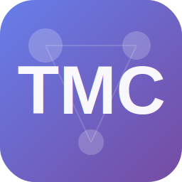

# TMC - Telegram Message Center

<div align="center">



**强大的 Telegram 消息转发管理系统**

[](https://www.docker.com/)
[](https://www.python.org/)
[](https://reactjs.org/)
[](LICENSE)

</div>

---

## 🌟 功能特性

### 核心功能
- 🤖 **多客户端管理** - 支持管理多个 Telegram 客户端账号
- 📝 **智能转发规则** - 基于关键词、来源聊天的灵活转发规则
- 🔄 **消息替换** - 支持消息内容的查找替换
- 📊 **实时监控** - 消息统计、日志查看、系统状态监控
- 🎨 **现代化界面** - 响应式设计，支持深色/浅色主题切换

### 技术亮点
- ⚡ **高性能** - 异步处理，支持大量并发消息
- 🔐 **安全可靠** - JWT 认证，完整的权限管理
- 📱 **响应式设计** - 完美适配桌面端和移动端
- 🎯 **类型安全** - 完整的 TypeScript 类型定义
- 🐳 **容器化部署** - 一键启动，开箱即用

---

## 🚀 快速开始

### 前置要求
- Docker & Docker Compose
- Telegram API 凭证（从 https://my.telegram.org 获取）

### 安装步骤

1. **克隆项目**
```bash
git clone <repository-url>
cd TMC
```

2. **配置环境变量**
```bash
cp env.example .env
# 编辑 .env 文件，填入以下必要配置：
# - API_ID, API_HASH, BOT_TOKEN
# - PHONE_NUMBER
# - ADMIN_USER_IDS
# - JWT_SECRET_KEY
```

3. **启动服务**
```bash
docker compose up -d --build
```

4. **访问系统**
- 打开浏览器访问: http://localhost:9393
- 默认账号: `admin` / `admin123`
- ⚠️ **首次登录后请立即修改密码！**

---

## 📖 使用指南

### 1. 添加 Telegram 客户端

在 **客户端管理** 页面：
1. 点击"添加客户端"
2. 输入客户端名称和手机号
3. 输入收到的验证码
4. 启动客户端

### 2. 配置转发规则

在 **转发规则** 页面：
1. 点击"新建规则"
2. 选择源聊天和目标聊天
3. 设置过滤关键词（可选）
4. 配置替换规则（可选）
5. 启用规则

### 3. 监控消息

在 **消息日志** 页面：
- 查看所有转发的消息
- 按时间、来源、状态筛选
- 查看详细的转发信息

### 4. 系统管理

在 **系统设置** 页面：
- 配置系统参数
- 管理用户账号
- 查看容器日志
- 监控系统状态

---

## 🏗️ 项目架构

```
TMC/
├── app/
│   ├── backend/          # Python FastAPI 后端
│   │   ├── api/          # API 路由
│   │   ├── models.py     # 数据模型
│   │   ├── database.py   # 数据库管理
│   │   └── main.py       # 应用入口
│   │
│   └── frontend/         # React 前端
│       ├── src/
│       │   ├── components/   # React 组件
│       │   ├── pages/        # 页面组件
│       │   ├── services/     # API 服务
│       │   └── theme/        # 主题系统
│       └── dist/         # 构建产物
│
├── data/                 # 数据库文件
├── logs/                 # 日志文件
├── sessions/             # Telegram 会话
└── docker-compose.yml    # Docker 编排
```

---

## 🛠️ 技术栈

### 后端
- **Python 3.11**
- **FastAPI** - 现代化的 Web 框架
- **SQLAlchemy** - 异步 ORM
- **Telethon** - Telegram 客户端库
- **Alembic** - 数据库迁移工具

### 前端
- **React 18** - UI 框架
- **TypeScript** - 类型安全
- **Ant Design** - UI 组件库
- **Vite** - 构建工具
- **React Query** - 数据管理

### 基础设施
- **Docker** - 容器化
- **SQLite** - 数据库
- **Nginx** - 静态文件服务（内置）

---

## 📊 系统截图

### 仪表板


### 转发规则管理


### 实时日志监控


---

## 🔧 开发指南

### 本地开发

```bash
# 后端开发
cd app/backend
python -m venv venv
source venv/bin/activate  # Windows: venv\Scripts\activate
pip install -r requirements.txt
uvicorn main:app --reload

# 前端开发
cd app/frontend
npm install
npm run dev
```

### 运行测试

```bash
# 后端测试（测试文件已归档）
cd app/backend
pytest

# 前端测试（测试文件已归档）
cd app/frontend
npm run test
```

### 构建生产版本

```bash
docker compose -f docker-compose.yml up -d --build
```

---

## 🐛 故障排查

### 常见问题

**Q: 登录后显示 401 未授权？**  
A: 清除浏览器缓存并硬刷新（Ctrl+Shift+R）

**Q: 容器日志无法加载？**  
A: 重新登录获取新的认证 token

**Q: 主题切换不生效？**  
A: 清除浏览器缓存，或使用隐私模式测试

**Q: 客户端无法连接？**  
A: 检查网络连接，确认 Telegram API 凭证正确

更多问题请查看 `PROJECT_STATUS.md` 文档。

---

## 📝 更新日志

### v1.0.0 (2025-10-06) 🎉
**首个生产就绪版本发布！**

- ✅ 完整的 Telegram 消息转发功能
- ✅ 完成主题系统重构，支持流畅的主题切换动画
- ✅ 修复所有认证相关问题（容器日志、系统状态）
- ✅ 解决数据库迁移冲突
- ✅ 优化项目结构，归档非生产文件
- ✅ 完善部署文档和故障排查指南
- ✅ GitHub Actions 自动构建
- ✅ Docker Hub 镜像发布

### v0.3.1 (内部版本)
- 实现用户认证系统
- 添加头像上传功能
- 优化 API 接口

### v0.3.0 (内部版本)
- 全面重构为前后端分离架构
- 引入 Docker 容器化部署
- 实现实时日志流

---

## 📄 许可证

本项目采用 MIT 许可证。详见 [LICENSE](LICENSE) 文件。

---

## 🤝 贡献

欢迎提交 Issue 和 Pull Request！

### 贡献指南
1. Fork 本项目
2. 创建特性分支 (`git checkout -b feature/AmazingFeature`)
3. 提交更改 (`git commit -m 'Add some AmazingFeature'`)
4. 推送到分支 (`git push origin feature/AmazingFeature`)
5. 提交 Pull Request

---

## 📞 支持与交流

### 💬 Telegram 交流群
加入我们的 Telegram 交流群，获取帮助和交流使用经验：

[](https://t.me/tg_message93)

### 📖 文档与反馈
- 📖 完整文档: 查看 `PROJECT_STATUS.md`
- 🐛 Bug 报告: [提交 GitHub Issue](https://github.com/Hav93/TMC/issues)
- 💡 功能建议: [提交 Feature Request](https://github.com/Hav93/TMC/issues/new)

---

## 💖 支持项目

如果 TMC 对你有帮助，欢迎通过以下方式支持项目：

### ⭐ Star 项目
给项目一个 Star 是对我们最大的鼓励！

### ☕ 请作者喝杯咖啡

<div align="center">
  
  <p><i>扫码支持，感谢您的慷慨！</i></p>
</div>

### 🤝 其他支持方式
- 💬 加入 Telegram 交流群参与讨论
- 🐛 提交 Bug 报告和功能建议
- 🔧 贡献代码（Pull Request）
- 📝 帮助改进文档
- 📢 分享给更多需要的人
- ⭐ 给项目点 Star

---

<div align="center">

**Made with ❤️ by TMC Team**

</div>
